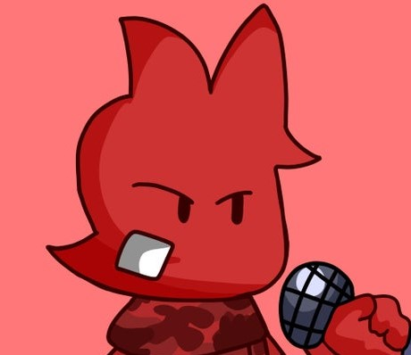

# ***Tordy Boi Github Repo***
Tordy Boi is a discord bot created by Fruitsy, based on Tord from Eddsworld I guess, lol.  
**CONTRIBUTORS ARE ALLOWED AT THE MOMENT!**

## What does this bot add?
Tordy Boi adds anything you could ever need, moderation, useless shit, utility, almost anything atleast, lol.

## Developers
- [Fruitsy](https://www.youtube.com/channel/UCpEq_oqCkhos6IQqYNy39BA) - Main Programmer

## Contributors
- *None lol*

## Running the bot?
Okie so there is a few things you may need first so you can run the bot.  

`Custom Prefix Json`, this is very much needed or the custom prefixes won't work.  
Make a .json file called "`prefixes.json`" and that should do for the prefixes.  
Almost forgot...make sure to put this into it:  

```json
{

}
```  
If it doesn't work then just remove it, idk lol. I'm writing this out of boredom.

`.env`, this is also VERY MUCH needed if you even have a token, of course its ignored for certain security reasons.  
Since I'm kinda too lazy to explain how to download the dotenv stuff and all, [ill just link a thing on how to do it.](https://stackoverflow.com/questions/63530888/how-would-i-go-about-creating-an-env-file-for-my-discord-bot-token)  
The answer should be below the question, lol.  

There is the _pychache_ that is also gitignored but its fine, it should create when you run the bot with the cogs.  
Also make sure to install [discord.py](https://pypi.org/project/discord.py/) along with [python](https://www.python.org/) or this may not work at all, lol.  

After this is done, you can pretty much do whatever you want?  
Idk, rename variables, rename files, transform things, whatever you kids do these days, lol.

## License
Just click [here.](LICENSE)